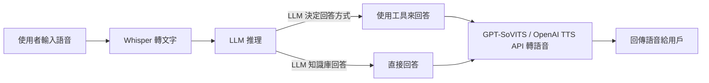

# 臺東大學 114 級資訊專題成果

此專案是專題裡面的 **後端系統**，提供一套 **LLM 語音對話系統的後端 API**。

---

## 系統流程

以下是系統的處理流程：



---

## 使用技術

- **語音轉文字**：[Whisper](https://github.com/openai/whisper)
- **語言模型推理**：[LLM](https://github.com/huggingface/transformers)
- **語音合成**：[GPT-SoVITS](https://github.com/innnky/so-vits-svc) 或 [OpenAI TTS API](https://platform.openai.com/docs/)
- **後端框架**：[Flask](https://flask.palletsprojects.com/)

---

## 如何使用

### 1. 建立 Python 虛擬環境（推薦）

#### **Windows**
```cmd
python -m venv env
env\Scripts\activate
```

#### **Mac OS**
```bash
python3 -m venv env
source env/bin/activate
```

> **建議使用 Python 3.12 以上版本。**

### 2. 安裝相依套件
在專案根目錄執行：
```bash
pip install -r requirements.txt
```

### 3. 配置 OpenAI API 密鑰（若使用 OpenAI API）
在虛擬環境下創建 `.env` 文件，並將 API 金鑰寫入其中，例如：

```
OPENAI_API_KEY=你的金鑰
google_search_api_key=你的搜尋 API Key
```


---

## 檔案結構

以下是此專案的檔案結構：

```plaintext
├── .gitignore
├── LICENSE
├── README.md
├── requirements.txt
├── api_chatbot.py
├── api_voice_input.py
├── api_voice_input_for_unity.py
├── api_voice_input_for_unity_openai_tts.py
├── pdfs
│   ├── 博物館物品.pdf
│   ├── 原住民資料.pdf
│   ├── 原住民資料2.pdf
│   └── README.md
├── core
│   ├── chatbot_core.py
│   └── promp_configs
│       ├── query_engine_prompt.json
│       ├── query_engine_prompt_CN.json
│       ├── react_system_header_str.txt
│       └── react_system_header_str_CN.txt
├── tests
│   ├── test_api_chatbot.py
│   ├── test_api_voice_input.py
│   ├── test_api_voice_input_for_unity.py
│   ├── test_openai_tts.py
│   └── test_torchaudio.py
└── utils
    ├── Denoiser.py
    └── WhisperTranscriber.py
```

## API 說明

### `api_chatbot.py`
**功能**：純文字呼叫 API，提供以下接口：
- `/chat`：Streaming Response（即逐步回傳推理結果）。
- `/normal_chat`：推理完成後一次性傳回結果。

---

### `api_voice_input_for_unity_openai_tts.py`
**功能**：用於 Unity 串接，使用 OpenAI 的 TTS API，提供以下接口：
- `/voice_chat`：接收語音，回傳語音。

---

### `api_voice_input_for_unity.py`
**功能**：用於 Unity 串接，使用 GPT-SoVITS 的 API（本地執行），需參考 GPT-SoVITS 的文件配置其 API。
- `/voice_chat`：接收語音，回傳語音。

---

### `api_voice_input.py`
**功能**：用於 Web 呼叫的語音 API。
- `/voice_chat`：接收語音，回傳語音。

### 檔案說明
- **`core/chatbot_core.py`**：LLM 主體推理程式。
- **`core/promp_configs`**：
  - `query_engine_prompt.json`：英文版本的 Query Prompt 配置。
  - `query_engine_prompt_CN.json`：中文版的 Query Prompt 配置。
  - `react_system_header_str.txt`：英文版本的 System Prompt，可根據需求修改。
  - `react_system_header_str_CN.txt`：中文版的 System Prompt，可根據需求修改。
  
## Flask 語音互動 AI Server 
`api_voice_input_for_unity_openai_tts.py`

此為功能最完整的 API server，整合 Whisper 語音辨識、RAG + LLM 問答（支援工具）、本地或雲端語音回傳。支援 Unity 串接與一般應用。

---

### API 路由概述

#### 1. POST /voice_chat
- 請求格式：multipart/form-data
  - file: 語音檔（.mp3/.wav/.ogg）
- 回傳格式：multipart/form-data
  - json: { "action": int, "response": str }
  - file: base64 編碼的 output.wav

#### 2. POST /text_chat_unity
- 請求格式：application/json
  - text: 輸入文字
  - tts_service: "local" 或 "openai"（可選）
- 回傳格式：multipart/form-data（同上）

#### 3. POST /text_chat
- 請求格式：application/json
  - text: 輸入文字
  - generate_audio: true/false（可選）
  - tts_service: "local" 或 "openai"（可選）
- 回傳格式：
  - 若 generate_audio=false：{ "response": "..." }
  - 若 true：multipart/form-data

#### 4. GET /test_api?prompt=xxx
- 測試用 API，可直接播放語音回應（不含 JSON）
- 查詢字串：?prompt=xxx
- 回傳格式：audio/wav 原始音訊串流

---

## 如何啟動 Flask Server

```
python api_voice_input_for_unity_openai_tts.py
```

---

## 資料準備（第一次使用前）

請在 `/pdfs` 資料夾內放置以下三份 PDF 檔案，否則系統無法建立向量資料庫（RAG）：

- 博物館物品.pdf
- 原住民資料.pdf
- 原住民資料2.pdf

注意：首次執行會轉為向量資料庫，可能會較久。

---

## LLM Agent 的調整方式

在 `core/chatbot_core.py` 裡可以自訂以下設定：

### 設定向量嵌入模型

```
Settings.embed_model = HuggingFaceEmbedding(model_name="intfloat/multilingual-e5-large-instruct")
# Settings.embed_model = OpenAIEmbedding(embed_batch_size=10)
```

### 設定 LLM 模型（預設用 openai，可改用 ollama）

```
Settings.llm = OpenAI(model="gpt-4o-mini-2024-07-18", stream=True, request_timeout=60.0)
# Settings.llm = Ollama(model="llama3:instruct", request_timeout=60.0)
```

---

### 自訂可用工具

在 `chatbot_core.py` 中：

```
tools = [museum_citation_tool, citation_tool, show_RAG_sources_tool, web_search_tool]
```

可以新增/刪除你要給 LLM 使用的工具。

範例：

```
def web_search(keyword: str) -> str:
    """  記得在這詳細打上 tool 描述，越詳細越好 """
    return "工具回傳的值會給 llm 參考使用"
```

---

### 修改 System Prompt

修改檔案：

```
core/promp_configs/react_system_header_str_CN.txt
```

若要停用 ReAct Prompt，可註解以下內容：

```
# react_system_header_str = self.load_string_from_file(...)
# agent.update_prompts(...)
```

---

### 不使用原住民相關資料（關閉 RAG）

請參考 `chatbot_core.py` 中你註解的範例，例如：

```
# nttu_path = "./storage/nttu"
# nttu_docs = SimpleDirectoryReader(...)
```

---

## CLI 使用方式（非 Flask）

```
if __name__ == "__main__":
    bot = ChatBot()
    while True:
        user_input = input("User: ")
        if user_input.lower() == "exit":
            break
        elif user_input.lower() == "reset":
            bot = ChatBot()
            print("Chatbot has been reset.")
        else:
            # Streaming（只支援 OpenAI）
            # response = bot.chat(user_input)
            # for token in response.response_gen:
            #     print(token, end="", flush=True)
            # print()

            # 非 Streaming（支援本地或 OpenAI）
            response = bot.normal_chat(user_input)
            print("Agent:", response)
```

---

歡迎依需求增減工具、替換模型、或搭配 Unity/Web 前端串接使用。


---

## TODO

- 將工具使用程式碼分離，增強可維護性。
- 支援 Docker 部署。
- 提供動態語言模型選擇功能。
