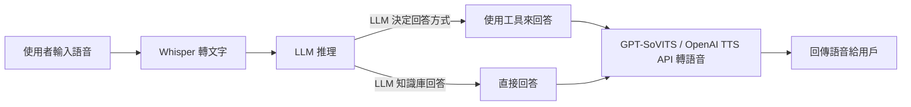

# 臺東大學 114 級資訊專題成果

此專案是專題裡面的 **後端系統**，提供一套 **LLM 語音對話系統的後端 API**。

---

## 系統流程

以下是系統的處理流程：



---

## 使用技術

- **語音轉文字**：[Whisper](https://github.com/openai/whisper)
- **語言模型推理**：[LLM](https://github.com/huggingface/transformers)
- **語音合成**：[GPT-SoVITS](https://github.com/innnky/so-vits-svc) 或 [OpenAI TTS API](https://platform.openai.com/docs/)
- **後端框架**：[Flask](https://flask.palletsprojects.com/)

---

## 如何使用

### 1. 建立 Python 虛擬環境（推薦）

#### **Windows**
```cmd
python -m venv env
env\Scripts\activate
```

#### **Mac OS**
```bash
python3 -m venv env
source env/bin/activate
```

> **建議使用 Python 3.12 以上版本。**

### 2. 安裝相依套件
在專案根目錄執行：
```bash
pip install -r requirements.txt
```

### 3. 配置 OpenAI API 密鑰（若使用 OpenAI API）
在虛擬環境下創建 `.env` 文件，並將 API 金鑰寫入其中，例如：

```plaintext
OPENAI_API_KEY=sk-....
```

---

## API 說明

### `api_chatbot.py`
**功能**：純文字呼叫 API，提供以下接口：
- `/chat`：Streaming Response（即逐步回傳推理結果）。
- `/normal_chat`：推理完成後一次性傳回結果。

---

### `api_voice_input_for_unity_openai_tts.py`
**功能**：用於 Unity 串接，使用 OpenAI 的 TTS API，提供以下接口：
- `/voice_chat`：接收語音，回傳語音。

---

### `api_voice_input_for_unity.py`
**功能**：用於 Unity 串接，使用 GPT-SoVITS 的 API（本地執行），需參考 GPT-SoVITS 的文件配置其 API。
- `/voice_chat`：接收語音，回傳語音。

---

### `api_voice_input.py`
**功能**：用於 Web 呼叫的語音 API。
- `/voice_chat`：接收語音，回傳語音。

---

## 檔案結構

以下是此專案的檔案結構：

```plaintext
├── .gitignore
├── LICENSE
├── README.md
├── requirements.txt
├── api_chatbot.py
├── api_voice_input.py
├── api_voice_input_for_unity.py
├── api_voice_input_for_unity_openai_tts.py
├── core
│   ├── chatbot_core.py
│   └── promp_configs
│       ├── query_engine_prompt.json
│       ├── query_engine_prompt_CN.json
│       ├── react_system_header_str.txt
│       └── react_system_header_str_CN.txt
├── tests
│   ├── test_api_chatbot.py
│   ├── test_api_voice_input.py
│   ├── test_api_voice_input_for_unity.py
│   ├── test_openai_tts.py
│   └── test_torchaudio.py
└── utils
    ├── Denoiser.py
    └── WhisperTranscriber.py
```

### 檔案說明
- **`core/chatbot_core.py`**：LLM 主體推理程式。
- **`core/promp_configs`**：
  - `query_engine_prompt.json`：英文版本的 Query Prompt 配置。
  - `query_engine_prompt_CN.json`：中文版的 Query Prompt 配置。
  - `react_system_header_str.txt`：英文版本的 System Prompt，可根據需求修改。
  - `react_system_header_str_CN.txt`：中文版的 System Prompt，可根據需求修改。

---

## TODO

- 將工具使用程式碼分離，增強可維護性。
- 支援 Docker 部署。
- 提供語言模型選擇功能。
